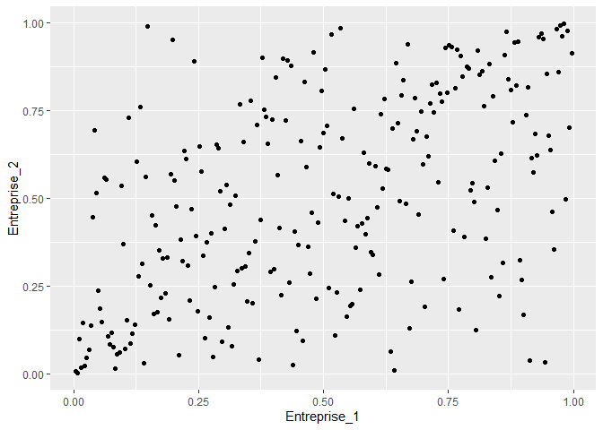

CreditVaR déterminées avec différentes copules et l’ASRF
================
Pierre Clauss

Je vais déterminer des CreditVaR à 1 an sur 2 créances. J’ai besoin de
données sur les 4 paramètres de risque de crédit que sont l’exposition,
la PD, la LGD et la dépendance entre créances.

## 1 Paramètres de risque de crédit

## 1.1 Exposition

L’exposition au défaut EAD (ou le nominal) est la même pour chaque
créance.

``` r
Nominal = 1000
```

## 1.2 PD

``` r
PD1 = 0.05
PD2 = 0.01
```

La PD de l’entreprise 1 est égale à 5.00% et celle de l’entreprise 2 est
égale à 1.00%.

## 1.3 LGD

J’utilise une LGD de 45% en moyenne pour la première créance et de 75%
en moyenne pour la seconde (avec des écarts-types associés) et j’estime
les paramètres des lois Bêta correspondantes.

``` r
mu1 = 0.45
sigma1 = 0.4
a1 = mu1 ^ 2 * (1 - mu1) / sigma1 ^ 2 - mu1
b1 = (mu1 * (1 - mu1) ^ 2) / sigma1 ^ 2 - (1 - mu1)

mu2 = 0.75
sigma2 = 0.2
a2 = mu2 ^ 2 * (1 - mu2) / sigma2 ^ 2 - mu2
b2 = (mu2 * (1 - mu2) ^ 2) / sigma2 ^ 2 - (1 - mu2)
```

## 1.4 Dépendance

A partir du modèle de Merton, j’utilise les rentabilités des actions
pour modéliser la structure de dépendance entre les défauts.

J’importe ces rentabilités du fichier Excel fourni à l’aide du package
**readxl** et de sa fonction `read_xlsx()`.

``` r
library(tidyverse)
library(readxl)
(renta <- read_xlsx(
  "data.xlsx",
  sheet = "CreditVaR",
  skip = 1,
  col_names = c("Entreprise_1", "Entreprise_2")
))
```

    ## # A tibble: 261 × 2
    ##    Entreprise_1 Entreprise_2
    ##           <dbl>        <dbl>
    ##  1   -0.00796       0.00914 
    ##  2    0.0380        0.00668 
    ##  3   -0.00492      -0.0199  
    ##  4    0.0307        0.0158  
    ##  5    0.0000163    -0.0145  
    ##  6   -0.00651       0.000404
    ##  7   -0.00701       0.0151  
    ##  8   -0.00445      -0.0220  
    ##  9    0.00415      -0.00175 
    ## 10   -0.00994      -0.0134  
    ## # ℹ 251 more rows

Observons le dépendogramme de la copule empirique associée à ces deux
séries de rentabilités.

``` r
library(copula)
ggplot(data = as_tibble(pobs(renta)),
       mapping = aes(x = Entreprise_1, y = Entreprise_2)) +
  geom_point()
```

<!-- -->

Nous pouvons estimer 2 copules paramétriques : la copule Gaussienne et
la copule Student.

``` r
set.seed(123)
correl_normal <- summary(fitCopula(normalCopula(), pobs(renta), method = "mpl"))$coefficients[1, 1]
gof_normal <- gofCopula(normalCopula(), pobs(renta), N = 50)$p.value

esti <- summary(fitCopula(tCopula(), pobs(renta), method = "mpl"))$coefficients
correl_t <- esti[1, 1]
degre <- esti[2, 1]
gof_t <- gofCopula(tCopula(df = 4, df.fixed = T), pobs(renta), N = 50)$p.value
```

La copule Gaussienne a pour paramètre la corrélation estimée par Maximum
de Vraisemblance égale à 0.54. Un test statistique d’adéquation à cette
copule donne une p-value de 30.39%.

La copule Student a pour paramètres la corrélation estimée par Maximum
de Vraisemblance égale à 0.53 et le degré de liberté égal à 3.49. Un
test statistique d’adéquation à cette copule donne une p-value de
81.37%.

## 2 CreditVaR par simulations Monte-Carlo

Je peux maintenant déterminer la CreditVaR par simulations Monte-Carlo
suivant 3 copules : produit, Gaussienne et Student.

Je réalise 1 million de simulations de pertes.

``` r
n <- 1e6
```

``` r
u1 <- runif(n)
u2 <- runif(n)
L1 <- (u1 < PD1) * rbeta(n, a1, b1) * Nominal
L2 <- (u2 < PD2) * rbeta(n, a2, b2) * Nominal
L = L1 + L2
CreditVaR_p = quantile(L, 0.999)
```

En modélisant la structure de dépendance par une copule produit, la
CreditVaR à 1 an à 99.9% est égale à 1000.

``` r
rcop <- rCopula(n, normalCopula(correl_normal))
u1 <- rcop[, 1]
u2 <- rcop[, 2]
L1 <- (u1 < PD1) * rbeta(n, a1, b1) * Nominal
L2 <- (u2 < PD2) * rbeta(n, a2, b2) * Nominal
L = L1 + L2
CreditVaR_g = quantile(L, 0.999)
```

En modélisant la structure de dépendance par une copule Gaussienne, la
CreditVaR à 1 an à 99.9% est égale à 1575.

``` r
rcop <- rCopula(n, tCopula(param = correl_t, df = degre))
u1 <- rcop[, 1]
u2 <- rcop[, 2]
L1 <- (u1 < PD1) * rbeta(n, a1, b1) * Nominal
L2 <- (u2 < PD2) * rbeta(n, a2, b2) * Nominal
L = L1 + L2
CreditVaR_t = quantile(L, 0.999)
```

En modélisant la structure de dépendance par une copule Student, la
CreditVaR à 1 an à 99.9% est égale à 1728.

## 3 CreditVaR avec l’ASRF

Pour comparer les résultats précédents, il est intéressant de calculer
la CreditVaR avec l’ASRF :

-\sqrt{\rho}\Phi^{-1}(1-99.9\%)}{\sqrt{1-\rho}}\right)")

La corrélation est estimée par celle des actions et est égale à 0.53.

``` r
correl_asrf <- cor(renta)[1, 2]
L1 <- pnorm((qnorm(PD1) - sqrt(correl_asrf) * qnorm(1 - 0.999)) / sqrt(1 - correl_asrf)) * mu1 * Nominal
L2 <- pnorm((qnorm(PD2) - sqrt(correl_asrf) * qnorm(1 - 0.999)) / sqrt(1 - correl_asrf)) * mu2 * Nominal
CreditVaR = L1 + L2
```

La CreditVaR issue de l’ASRF à 1 an à 99.9% est égale à 710 ce qui est
plutôt éloigné des valeurs obtenues précédemment par simulations Monte
Carlo.

En fait, l’ASRF est défini pour un portefeuille granulaire donc avec un
grand nombre de créances homogènes.

Ainsi, pour comparer les différents calculs, je vais déterminer des
CreditVaR en simulant 2000 créances de nominal 1 euro, les 1000
premières créances ayant les mêmes PD et LGD que la première créance de
l’exemple précédent et les 1000 suivantes les mêmes PD et LGD que la
seconde créance. La dépendance reste la même entre les 2000 créances que
celle entre les 2 créances de l’exemple précédent.

J’obtiens une CreditVaR avec copule Gaussienne à 1 an à 99.9% égale à
725, soit proche de celle de l’ASRF.

Concernant la copule produit, la CréditVaR est proche de 0 égale à 46 et
enfin avec la copule Student, la CreditVaR est plus élevée que celle de
l’ASRF, égale à 946.
