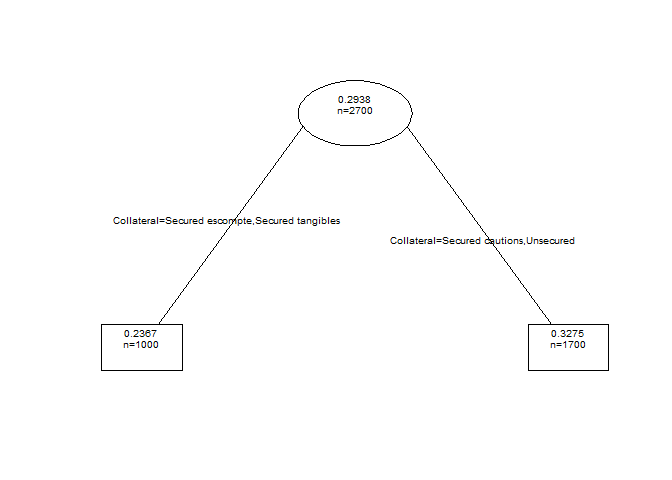

Modélisation de la LGD des actifs sains des entreprises
================
Pierre Clauss

## Préambule

Je précise en préambule les 3 étapes nécessaires pour la réussite d’un
projet en modélisation statistique :

1.  données : (i) importation, (ii) wrangling et (iii) visualisation (ou
    appelée encore *analyse exploratoire des données*)
2.  modélisation
3.  communication des résultats

Pour réaliser ces 3 étapes, l’association des langages R et Python peut
s’avérer très utile.

En effet, l’univers du package [**tidyverse**](https://r4ds.had.co.nz/)
est essentiel en R aujourd’hui pour l’exploration des données, les
packages [**scikit-learn**](https://scikit-learn.org/stable/) et
[**TensorFlow**](https://www.tensorflow.org/) n’ont pas leur équivalent
pour développer des algorithmes de machine et deep learning, et enfin la
communication des résultats via
[**RMarkdown**](https://r4ds.had.co.nz/r-markdown.html) est très
efficiente.

J’ajoute que R est complémentaire de Python pour l’étape de modélisation
dans l’évaluation des modèles utilisés (vérification des hypothèses
sous-jacentes par exemple).

Le package R [**reticulate**](https://rstudio.github.io/reticulate/)
permet ainsi de passer les data de R à Python (**r.data**) et de Python
à R (**py\$data**).

``` r
library(tidyverse)
library(reticulate)
```

## 1 Données

### 1.1 Importation

J’importe les données à l’aide du package **readxl**, qui gère les
fichiers Excel parfaitement (décimales, pourcentages, valeurs
manquantes), avec la fonction `read_xlsx()`.

``` r
library(readxl)
(lgd <- read_xlsx(
  "data.xlsx",
  sheet = "LGD"
))
```

    ## # A tibble: 2,700 × 3
    ##             LGD    CA Collateral
    ##           <dbl> <dbl> <chr>     
    ##  1 0.000497     142.  Unsecured 
    ##  2 0.0000000129  68.8 Unsecured 
    ##  3 0.999        155.  Unsecured 
    ##  4 0.000471      93.5 Unsecured 
    ##  5 0.000183      79.5 Unsecured 
    ##  6 0.0000772    111.  Unsecured 
    ##  7 0.675         94.9 Unsecured 
    ##  8 0.000218      99.6 Unsecured 
    ##  9 0.0181        84.0 Unsecured 
    ## 10 0.000754      85.4 Unsecured 
    ## # ℹ 2,690 more rows

Les données ont été simulées à l’aide de lois Beta classiquement
utilisées pour modéliser le processus générateur des réalisations de
LGD. En effet, le fait stylisé de la LGD est la bimodalité de sa
distribution de probabilité (nous l’observerons dans l’étape
visualisation), ce que permet la loi Beta.

### 1.2 Wrangling

Le wrangling (*démêlage* en français) est plutôt simple sur des données
simulées et donc sans souci particulier.

Nous pouvons à l’aide du package **DataExplorer** obtenir un résumé des
données, données que l’on peut donc considérer comme **tidy**.

``` r
library(DataExplorer)
plot_intro(lgd)
```

<!-- -->

### 1.3 Visualisation

Une première viz est la distribution des LGD. Nous illustrons ainsi
ci-dessous le fait stylisé de la LGD à savoir sa bimodalité : dans un
processus de recouvrement suite à la défaillance d’une entreprise,
souvent, soit on récupère presque tout, soit on perd presque tout.

``` r
ggplot(data = lgd, aes(LGD)) +
  geom_histogram()
```

<!-- -->

Quelques graphiques descriptifs nous fournissent des informations sur
les différences de LGD entre les modalités de la variable catégorielle.

``` r
ggplot(
  data = lgd,
  mapping = aes(x = fct_infreq(Collateral))
) +
  geom_bar()
```

<!-- -->

``` r
Collateral_ordered <- fct_reorder(lgd$Collateral, lgd$LGD, mean)
ggplot(
  data = lgd, 
  mapping = aes(x = Collateral_ordered, y = LGD)
) +
  geom_boxplot()
```

<!-- -->

``` r
ggplot(data = lgd) +
  geom_point(mapping = aes(x = CA, y = LGD, color = Collateral))
```

<!-- -->

## 2 Modélisation

Pour choisir le bon type de modélisation, il faut tout d’abord savoir si
l’apprentissage est supervisé ou non. Dans ce dernier cas, les données
ne sont pas labelisées et des méthodes de partitionnement ou clustering
(**k-means** par exemple) et de réduction de dimension (**ACM** par
exemple comme précédemment) peuvent être utilisées. Ici, les données
sont labélisées par la valeur de LGD. L’apprentissage est donc
supervisé. Reste à savoir si la famille de modèles est celle de la
régression (variable à expliquer quantitative) ou celle de la
classification (variable qualitative). La LGD ayant des valeurs
quantitatives sur le support \[0,1\], nous pouvons pertinemment utiliser
des méthodes de régression.

Pour une illustration de ces choix, voici l’excellente [illustration de
**scikit-learn**](http://scikit-learn.org/stable/tutorial/machine_learning_map/index.html)

L’objectif est donc de trouver un modèle qui permette de prédire la
valeur de LGD à partir de ses principaux features ou *risk drivers*.
L’idée ici est de faire un premier pas dans la modélisation et la
prédiction de la LGD.

### 2.1 Modélisation sous R

Avec le type de variables que nous avons, à savoir une variable
quantitative et une variable qualitative, une analyse de covariance sera
pertinente (ANCOVA).

Nous allons donc faire 3 modèles :

1.  un modèle complet **mod.complet** avec pentes et ordonnées à
    l’origine différentes suivant le type de collatéral,

2.  un modèle **mod.pente** avec pentes communes relativement au chiffre
    d’affaires et ordonnées à l’origine différentes suivant le type de
    collatéral,

3.  un modèle **mod.ordonnee** avec ordonnées à l’origine communes et
    pentes relatives au CA différentes suivant le collatéral.

Puis nous faisons des tests d’égalité des pentes et d’égalité des
ordonnées à l’origine pour choisir le modèle le plus pertinent à l’aide
de la fonction **anova**.

Au vu des résultats de ces tests, on accepte l’égalité des pentes avec
des ordonnées à l’origine différentes. On choisirait le modèle
**mod.pente**.

Mais on accepte aussi l’égalité des ordonnées à l’origine avec des
pentes différentes. On choisirait le modèle **mod.ordonnee**.

Ces 2 modèles ne sont pas emboîtés mais en étudiant les résultats des
coefficients estimés ainsi que des graphiques de la data viz (boxplot
entre autres qui montrent un effet collatéral sur le niveau de LGD),
nous penchons pour le modèle avec pente unique et ordonnées à l’origine
différentes.

Ceci est confirmé par le dernier résultat ci-dessous qui compare ce
modèle finalement choisi avec un modèle simple sans aucun effet du
collaréral (modèle expliquant la LGD par le CA). Et nous rejettons alors
l’égalité des ordonnées à l’origine, confirmant notre choix.

``` r
mod.complet = lm(LGD ~ Collateral + Collateral:CA - 1, data = lgd)
summary(mod.complet)
```

    ## 
    ## Call:
    ## lm(formula = LGD ~ Collateral + Collateral:CA - 1, data = lgd)
    ## 
    ## Residuals:
    ##     Min      1Q  Median      3Q     Max 
    ## -0.3553 -0.2896 -0.2138  0.2992  0.7904 
    ## 
    ## Coefficients:
    ##                                  Estimate Std. Error t value Pr(>|t|)    
    ## CollateralSecured cautions      2.943e-01  2.001e-01   1.470 0.141546    
    ## CollateralSecured escompte      3.069e-01  8.903e-02   3.447 0.000575 ***
    ## CollateralSecured tangibles     2.830e-01  8.321e-02   3.401 0.000680 ***
    ## CollateralUnsecured             3.660e-01  1.629e-02  22.468  < 2e-16 ***
    ## CollateralSecured cautions:CA  -3.854e-05  1.972e-03  -0.020 0.984412    
    ## CollateralSecured escompte:CA  -6.814e-04  8.704e-04  -0.783 0.433813    
    ## CollateralSecured tangibles:CA -4.840e-04  8.198e-04  -0.590 0.554982    
    ## CollateralUnsecured:CA         -2.312e-04  8.538e-05  -2.708 0.006814 ** 
    ## ---
    ## Signif. codes:  0 '***' 0.001 '**' 0.01 '*' 0.05 '.' 0.1 ' ' 1
    ## 
    ## Residual standard error: 0.372 on 2692 degrees of freedom
    ## Multiple R-squared:  0.3915, Adjusted R-squared:  0.3896 
    ## F-statistic: 216.5 on 8 and 2692 DF,  p-value: < 2.2e-16

``` r
mod.pente = lm(LGD ~ Collateral + CA - 1, data = lgd)
summary(mod.pente)
```

    ## 
    ## Call:
    ## lm(formula = LGD ~ Collateral + CA - 1, data = lgd)
    ## 
    ## Residuals:
    ##     Min      1Q  Median      3Q     Max 
    ## -0.3560 -0.2888 -0.2169  0.2978  0.7846 
    ## 
    ## Coefficients:
    ##                               Estimate Std. Error t value Pr(>|t|)    
    ## CollateralSecured cautions   0.3141301  0.0381206   8.240 2.65e-16 ***
    ## CollateralSecured escompte   0.2623031  0.0186652  14.053  < 2e-16 ***
    ## CollateralSecured tangibles  0.2585417  0.0186263  13.880  < 2e-16 ***
    ## CollateralUnsecured          0.3670464  0.0161620  22.710  < 2e-16 ***
    ## CA                          -0.0002378  0.0000844  -2.817  0.00488 ** 
    ## ---
    ## Signif. codes:  0 '***' 0.001 '**' 0.01 '*' 0.05 '.' 0.1 ' ' 1
    ## 
    ## Residual standard error: 0.3718 on 2695 degrees of freedom
    ## Multiple R-squared:  0.3914, Adjusted R-squared:  0.3902 
    ## F-statistic: 346.6 on 5 and 2695 DF,  p-value: < 2.2e-16

``` r
mod.ordonnee = lm(LGD ~ Collateral:CA, data = lgd)
summary(mod.ordonnee)
```

    ## 
    ## Call:
    ## lm(formula = LGD ~ Collateral:CA, data = lgd)
    ## 
    ## Residuals:
    ##     Min      1Q  Median      3Q     Max 
    ## -0.3511 -0.2905 -0.2091  0.3018  0.8136 
    ## 
    ## Coefficients:
    ##                                  Estimate Std. Error t value Pr(>|t|)    
    ## (Intercept)                     3.608e-01  1.568e-02  23.006  < 2e-16 ***
    ## CollateralSecured cautions:CA  -6.828e-04  3.967e-04  -1.721   0.0854 .  
    ## CollateralSecured escompte:CA  -1.199e-03  2.216e-04  -5.410 6.84e-08 ***
    ## CollateralSecured tangibles:CA -1.235e-03  2.231e-04  -5.535 3.42e-08 ***
    ## CollateralUnsecured:CA         -2.087e-04  8.323e-05  -2.507   0.0122 *  
    ## ---
    ## Signif. codes:  0 '***' 0.001 '**' 0.01 '*' 0.05 '.' 0.1 ' ' 1
    ## 
    ## Residual standard error: 0.3719 on 2695 degrees of freedom
    ## Multiple R-squared:  0.0166, Adjusted R-squared:  0.01514 
    ## F-statistic: 11.37 on 4 and 2695 DF,  p-value: 3.753e-09

``` r
# Test égalité des pentes
anova(mod.complet, mod.pente)
```

    ## Analysis of Variance Table
    ## 
    ## Model 1: LGD ~ Collateral + Collateral:CA - 1
    ## Model 2: LGD ~ Collateral + CA - 1
    ##   Res.Df    RSS Df Sum of Sq     F Pr(>F)
    ## 1   2692 372.50                          
    ## 2   2695 372.55 -3 -0.050654 0.122 0.9472

``` r
#Test égalité des ordonnées
anova(mod.complet, mod.ordonnee)
```

    ## Analysis of Variance Table
    ## 
    ## Model 1: LGD ~ Collateral + Collateral:CA - 1
    ## Model 2: LGD ~ Collateral:CA
    ##   Res.Df   RSS Df Sum of Sq      F Pr(>F)
    ## 1   2692 372.5                           
    ## 2   2695 372.7 -3  -0.20112 0.4845 0.6931

``` r
#Test avec un modèle sans effet collatéral
mod.simple <- lm(LGD ~ CA, data = lgd)
summary(mod.simple)
```

    ## 
    ## Call:
    ## lm(formula = LGD ~ CA, data = lgd)
    ## 
    ## Residuals:
    ##     Min      1Q  Median      3Q     Max 
    ## -0.2993 -0.2932 -0.2358  0.3086  0.7360 
    ## 
    ## Coefficients:
    ##               Estimate Std. Error t value Pr(>|t|)    
    ## (Intercept)  3.022e-01  1.298e-02  23.284   <2e-16 ***
    ## CA          -6.287e-05  8.081e-05  -0.778    0.437    
    ## ---
    ## Signif. codes:  0 '***' 0.001 '**' 0.01 '*' 0.05 '.' 0.1 ' ' 1
    ## 
    ## Residual standard error: 0.3748 on 2698 degrees of freedom
    ## Multiple R-squared:  0.0002243,  Adjusted R-squared:  -0.0001463 
    ## F-statistic: 0.6052 on 1 and 2698 DF,  p-value: 0.4367

``` r
anova(mod.pente, mod.simple)
```

    ## Analysis of Variance Table
    ## 
    ## Model 1: LGD ~ Collateral + CA - 1
    ## Model 2: LGD ~ CA
    ##   Res.Df    RSS Df Sum of Sq      F    Pr(>F)    
    ## 1   2695 372.55                                  
    ## 2   2698 378.91 -3   -6.3555 15.325 6.912e-10 ***
    ## ---
    ## Signif. codes:  0 '***' 0.001 '**' 0.01 '*' 0.05 '.' 0.1 ' ' 1

En faisant un arbre de régression, nous pouvons obtenir un autre type de
modèle confirmant l’impact du collatéral.

``` r
library(rpart)
arbre <- rpart(LGD ~ ., data = lgd)
plot(arbre, branch = .2, uniform = T, compress = T, margin = .1)
text(arbre, use.n = T, fancy = T, all = T, pretty = 0, cex = 0.6)
```

<!-- -->

### 2.2 Modélisation sous Python

A partir du package **statsmodels**, nous testons le modèle de
régression avec pente commune relative au CA et ordonnées à l’origine
différenciées.

Précisons que nous avons besoin en Python d’encoder les variables
qualitatives en variables quantitatives (codage disjonctif complet ou
*dummy variable*) pour pouvoir les utiliser dans un modèle
(contrairement à R).

``` python
import pandas as pd
import numpy as np
import statsmodels.api as sm

lgd_py = r.lgd
lgd_py = pd.get_dummies(lgd_py, columns=['Collateral'], dtype='int', drop_first = True)

y = lgd_py['LGD']
X = lgd_py.drop(columns=['LGD'])
mod = sm.OLS(y, X).fit()
print(mod.summary())
```

    ##                                  OLS Regression Results                                 
    ## ========================================================================================
    ## Dep. Variable:                     LGD   R-squared (uncentered):                   0.376
    ## Model:                             OLS   Adj. R-squared (uncentered):              0.375
    ## Method:                  Least Squares   F-statistic:                              406.2
    ## Date:              sam., 21 sept. 2024   Prob (F-statistic):                   3.79e-274
    ## Time:                         10:25:32   Log-Likelihood:                         -1190.9
    ## No. Observations:                 2700   AIC:                                      2390.
    ## Df Residuals:                     2696   BIC:                                      2413.
    ## Df Model:                            4                                                  
    ## Covariance Type:             nonrobust                                                  
    ## ================================================================================================
    ##                                    coef    std err          t      P>|t|      [0.025      0.975]
    ## ------------------------------------------------------------------------------------------------
    ## CA                           -8.426e-05   8.33e-05     -1.011      0.312      -0.000    7.91e-05
    ## Collateral_Secured escompte      0.2469      0.019     13.132      0.000       0.210       0.284
    ## Collateral_Secured tangibles     0.2433      0.019     12.966      0.000       0.206       0.280
    ## Collateral_Unsecured             0.3430      0.016     21.314      0.000       0.311       0.375
    ## ==============================================================================
    ## Omnibus:                      521.319   Durbin-Watson:                   1.935
    ## Prob(Omnibus):                  0.000   Jarque-Bera (JB):              402.724
    ## Skew:                           0.848   Prob(JB):                     3.55e-88
    ## Kurtosis:                       2.160   Cond. No.                         503.
    ## ==============================================================================
    ## 
    ## Notes:
    ## [1] R² is computed without centering (uncentered) since the model does not contain a constant.
    ## [2] Standard Errors assume that the covariance matrix of the errors is correctly specified.
