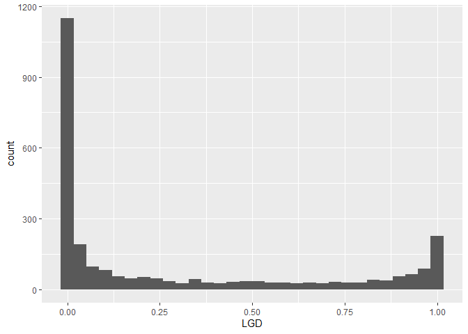
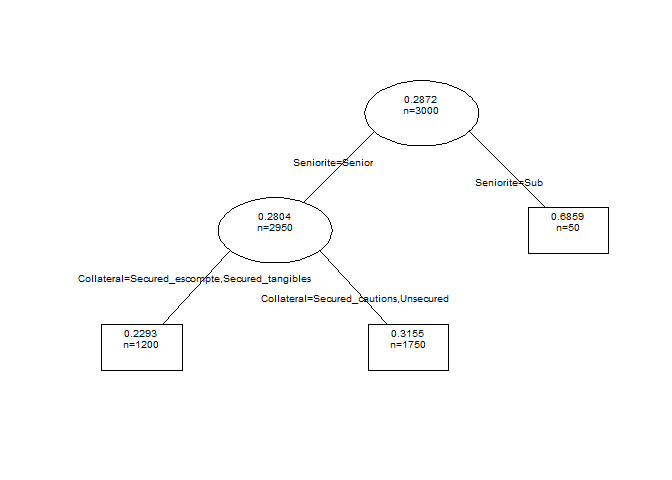

Modélisation de la LGD des actifs sains des entreprises
================
Pierre Clauss

## Préambule

Je précise en préambule les 3 étapes nécessaires pour la réussite d’un
projet de modélisation :

1.  données : (i) importation, (ii) wrangling et (iii) visualisation (ou
    appelée encore *analyse exploratoire des données*)
2.  modélisation
3.  communication des résultats

L’univers du package [**tidyverse**](https://r4ds.had.co.nz/) est
essentiel en R aujourd’hui pour réaliser ces différentes étapes.

``` r
library(tidyverse)
```

## 1 Données

### 1.1 Importation

J’importe les données à l’aide du package **readxl**, qui gère les
fichiers Excel parfaitement (décimales, pourcentages, valeurs
manquantes), avec la fonction `read_xlsx()`.

``` r
library(readxl)
(lgd <- read_xlsx(
  "data.xlsx",
  sheet = "LGD"
))
```

    ## # A tibble: 3,000 × 5
    ##             LGD Seniorite Taille Collateral Pays 
    ##           <dbl> <chr>     <chr>  <chr>      <chr>
    ##  1 0.00106      Senior    PME    Unsecured  OCDE 
    ##  2 0.0000000514 Senior    PME    Unsecured  OCDE 
    ##  3 0.000487     Senior    PME    Unsecured  OCDE 
    ##  4 0.995        Senior    PME    Unsecured  OCDE 
    ##  5 0.972        Senior    PME    Unsecured  OCDE 
    ##  6 0.723        Senior    PME    Unsecured  OCDE 
    ##  7 0.0000000280 Senior    PME    Unsecured  OCDE 
    ##  8 0.00000191   Senior    PME    Unsecured  OCDE 
    ##  9 0.00792      Senior    PME    Unsecured  OCDE 
    ## 10 0.239        Senior    PME    Unsecured  OCDE 
    ## # ℹ 2,990 more rows

Les données sont simulées à l’aide de lois Beta classiquement utilisées
pour modéliser le processus générateur des réalisations de LGD. En
effet, le fait stylisé de la LGD est la bimodalité de sa distribution de
probabilité (nous l’observerons dans l’étape visualisation) ce que
permet la loi Beta.

### 1.2 Wrangling

Le wrangling (*démêlage* en français) est plutôt simple sur des données
simulées et donc sans souci particulier.

Nous pouvons à l’aide du package **DataExplorer** obtenir un résumé des
données, données que l’on peut donc considérer comme **tidy**.

``` r
library(DataExplorer)
plot_intro(lgd)
```

<!-- -->

### 1.3 Visualisation

Une première viz est la distribution des LGD. Nous illustrons ainsi
ci-dessous le fait stylisé de la LGD, à savoir sa bimodalité : dans un
processus de recouvrement suite à la défaillance d’une entreprise,
souvent, soit on récupère presque tout, soit on perd presque tout.

``` r
ggplot(data = lgd, aes(LGD)) +
  geom_histogram()
```

<!-- -->

Quelques premières statistiques et graphiques descriptifs nous
fournissent des informations sur les différences de LGD entre les
modalités des variables catégorielles.

``` r
lgd %>%
  group_by(Seniorite) %>%
  summarize(
    number = n(),
    mean = mean(LGD),
    median = median(LGD),
    min = min(LGD),
    max = max(LGD)
  )
```

    ## # A tibble: 2 × 6
    ##   Seniorite number  mean median      min   max
    ##   <chr>      <int> <dbl>  <dbl>    <dbl> <dbl>
    ## 1 Senior      2950 0.280 0.0497 3.80e-36  1.00
    ## 2 Sub           50 0.686 0.767  8.67e- 4  1.00

``` r
lgd %>%
  group_by(Taille) %>%
  summarize(
    number = n(),
    mean = mean(LGD),
    median = median(LGD),
    min = min(LGD),
    max = max(LGD)
  )
```

    ## # A tibble: 4 × 6
    ##   Taille number  mean  median      min   max
    ##   <chr>   <int> <dbl>   <dbl>    <dbl> <dbl>
    ## 1 ETI       500 0.341 0.138   1.22e-19  1.00
    ## 2 GE        300 0.408 0.250   1.63e-24  1.00
    ## 3 PME      2100 0.262 0.0355  3.80e-36  1.00
    ## 4 TGE       100 0.180 0.00406 1.34e-18  1.00

``` r
ggplot(
  data = lgd,
  mapping = aes(x = fct_infreq(Collateral))
) +
  geom_bar()
```

<!-- -->

``` r
Collateral_ordered <- fct_reorder(lgd$Collateral, lgd$LGD, mean)
ggplot(
  data = lgd, 
  mapping = aes(x = Collateral_ordered, y = LGD)
) +
  geom_boxplot()
```

<!-- -->

``` r
Pays_ordered <- fct_reorder(lgd$Pays, lgd$LGD, mean)
ggplot(
  data = lgd, 
  mapping = aes(x = Pays_ordered, y = LGD)
) +
  geom_boxplot()
```

<!-- -->

Après cette première visualisation, il est nécessaire d’aller plus loin
et de mobiliser une technique exploratoire plus puissante pour observer
précisément les similitudes entre modalités de variables. Nous allons
utiliser une technique d’apprentissage non supervisé de réduction de la
dimension : l’Analyse des Correspondances Multiples, puisque nous
n’avons que des variables catégorielles comme variables explicatives de
la LGD ; nous ajoutons cette dernière en variable illustrative.

``` r
library(FactoMineR)
res.MCA <- MCA(lgd, graph = F, quanti.sup = 1)
plot.MCA(res.MCA, invisible = c("ind"), col.var = 'black', cex = 0.7)
```

<!-- -->

Nous observons que les modalités *Sub* et *Emergents* sont éloignées des
autres modalités sur la première dimension. Sur la seconde dimension,
*TGE* et *ETI* s’opposent à *PME* et les modalités *secured* sont
proches et s’opposent à *unsecured*.

## 2 Modélisation

Pour choisir le bon type de modélisation, il faut tout d’abord savoir si
l’apprentissage est supervisé ou non. Dans ce dernier cas, les données
ne sont pas labelisées et des méthodes de partitionnement ou clustering
(**k-means** par exemple) et de réduction de dimension (**ACM** par
exemple comme précédemment) peuvent être utilisées. Ici, les données
sont labélisées par la valeur de LGD. L’apprentissage est donc
supervisé. Reste à savoir si la famille de modèles est celle de la
régression (variable à expliquer quantitative) ou celle de la
classification (variable qualitative). La LGD ayant des valeurs
quantitatives sur le support \[0,1\], nous pouvons pertinemment utiliser
des méthodes de régression.

Pour une illustration de ces choix, voici l’excellente [illustration de
**scikit-learn**](http://scikit-learn.org/stable/tutorial/machine_learning_map/index.html)

L’objectif est donc de trouver un modèle qui permette de prédire la
valeur de LGD à partir de ses principaux features ou *risk drivers*.

3 étapes peuvent être définies pour la modélisation :

1.  séparation de l’échantillon en échantillon d’apprentissage et
    échantillon de test (75/25 classiquement)
2.  ajustement du modèle sur l’échantillon d’apprentissage suivant
    plusieurs méthodes possibles (régression linéaire, régularisée,
    arbre de décision, méthode ensembliste bagging ou boosting, etc.)
3.  évaluation de la performance de la prédiction du modèle sur
    l’échantillon de test. Elle dépend du type de prédiction réalisée :
    soit une classe pour la classification, soit une valeur quantitative
    pour la régression. Pour la première, la matrice de confusion permet
    d’évaluer la performance de l’ajustement du modèle. Concernant la
    prédiction d’une valeur quantitative, le critère classique de *R²*
    permet d’en évaluer la performance.

Sous R, le package **caret** me semble le plus complet car il appelle de
nombreux autres packages et propose ainsi dans sa fonction **train** de
[nombreux types de
modèles](http://topepo.github.io/caret/available-models.html).

Les modélisations ne sont pas abouties puisque le *tuning* des
hyper-paramètres n’est pas réalisé. L’objectif est de faire un premier
pas dans la modélisation et la prédiction de la LGD.

Enfin, nous pouvons observer la faiblesse de la performance des modèles
: nous y reviendrons lors de la conclusion.

``` r
library(caret)
set.seed(123)
sample_train <- lgd %>% sample_frac(0.75)
sample_test <- anti_join(lgd, sample_train)

lm_fit = train(LGD ~ ., data = sample_train, method = "lm")
lm_pred <- predict(lm_fit, sample_test)
postResample(pred = lm_pred, obs = sample_test$LGD)["Rsquared"]
```

    ##  Rsquared 
    ## 0.0345636

``` r
tree_fit = train(LGD ~ ., data = sample_train, method = "rpart")
tree_pred <- predict(tree_fit, sample_test)
postResample(pred = tree_pred, obs = sample_test$LGD)["Rsquared"]
```

    ##   Rsquared 
    ## 0.02936675

``` r
knn_fit = train(LGD ~ ., data = sample_train, method = "knn")
knn_pred <- predict(knn_fit, sample_test)
postResample(pred = knn_pred, obs = sample_test$LGD)["Rsquared"]
```

    ##   Rsquared 
    ## 0.03402572

``` r
# ridge_fit = train(LGD ~ ., data = sample_train, method = "ridge")
# ridge_pred <- predict(ridge_fit, sample_test)
# postResample(pred = ridge_pred, obs = sample_test$LGD)["Rsquared"]
# 
# lasso_fit = train(LGD ~ ., data = sample_train, method = "lasso")
# lasso_pred <- predict(lasso_fit, sample_test)
# postResample(pred = lasso_pred, obs = sample_test$LGD)["Rsquared"]
# 
# rf_fit = train(LGD ~ ., data = sample_train, method = "rf")
# rf_pred <- predict(rf_fit, sample_test)
# postResample(pred = rf_pred, obs = sample_test$LGD)["Rsquared"]
# 
# xgboost_fit = train(LGD ~ ., data = sample_train, method = "xgbLinear", objective = "reg:squarederror")
# xgboost_pred <- predict(lm_fit, sample_test)
# postResample(pred = xgboost_pred, obs = sample_test$LGD)["Rsquared"]
```

## Pour conclure

Les *R²* ne révèlent pas des régressions très performantes. Néanmoins,
la LGD est un animal particulier. Vous pouvez revoir dans la section
data viz l’histogramme et la distribution bimodale de la LGD. Cette
bimodalité rend nécessairement difficile l’interprétation des *R²*.

Nous pouvons donc nous concentrer plutôt sur la pertinence bancaire de
la partition en **risk drivers** de la LGD. Un arbre de régression par
exemple peut l’illustrer : en effet, l’arbre segmente les LGD en
fonction de leur séniorité et de la présence d’une sûreté solide ou non.

``` r
library(rpart)
arbre <- rpart(LGD ~ ., data = lgd)
plot(arbre, branch = .2, uniform = T, compress = T, margin = .1)
text(arbre, use.n = T, fancy = T, all = T, pretty = 0, cex = 0.6)
```

<!-- -->

Pour aller plus loin, je conseille la lecture du papier de [Hurlin,
Leymarie, Patin
(2018)](https://halshs.archives-ouvertes.fr/halshs-01516147v3/document)
qui compare 6 modèles en les évaluant à l’aide d’une méthode
alternative.
